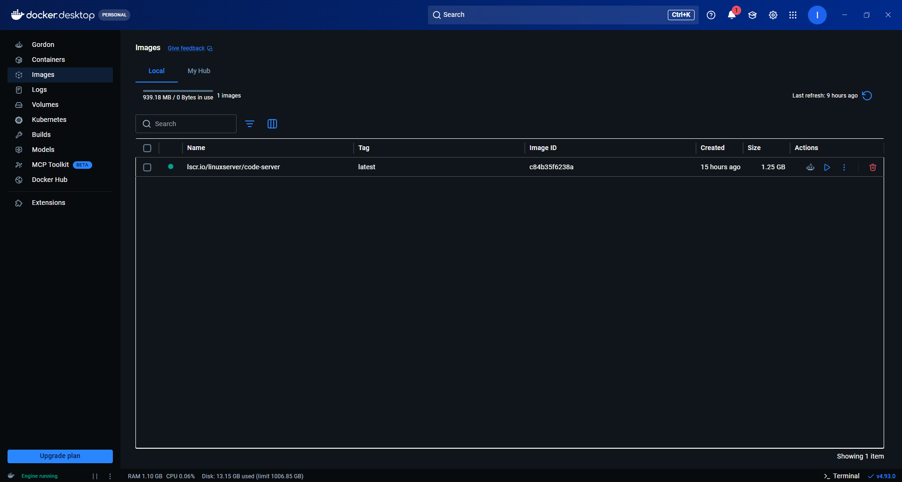
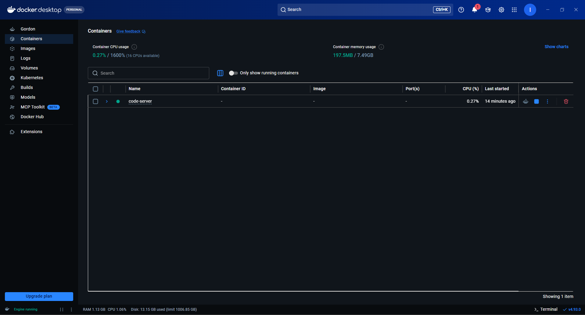
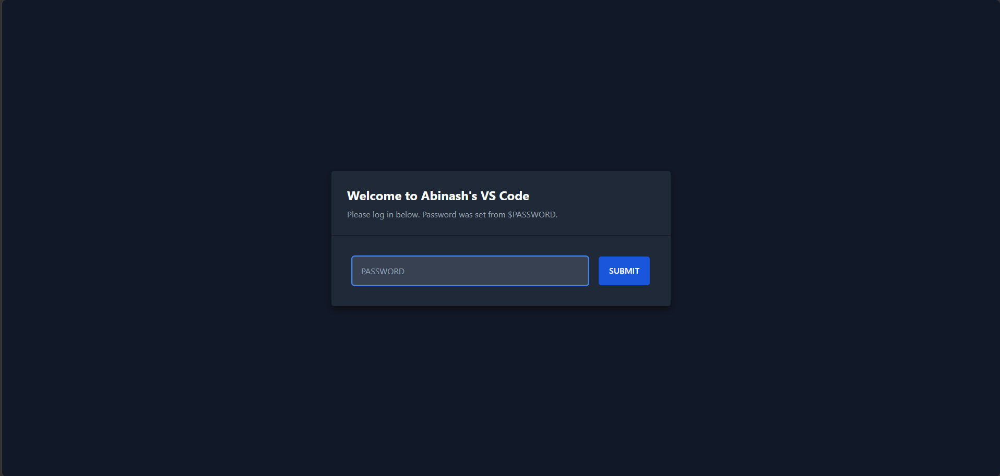
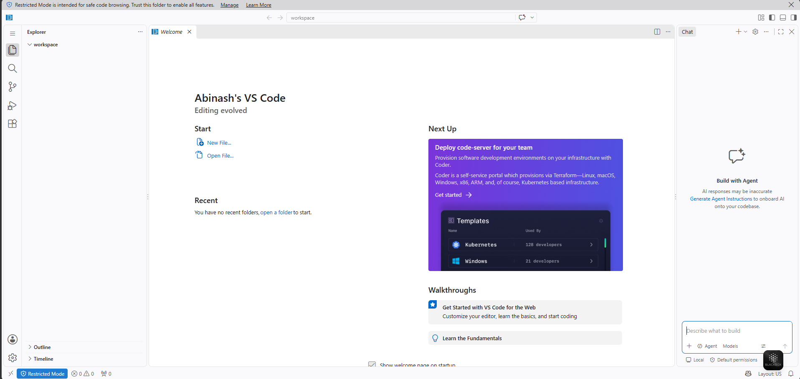

<div align="center">

# 🐳 docker-vscode-server-hub

### Your self-hosted VS Code workspace: code from anywhere, on any device, with nothing installed locally.


</div>

---

This repository is a complete guide to running a fully isolated Visual Studio Code environment inside a Docker container.

By combining [**code-server**](https://github.com/coder/code-server) and [**Tailscale**](https://tailscale.com/), you can code from any device (an iPad, Chromebook, or laptop) through a secure, private `https://` link. You never have to clutter your local machine with programming languages or dependencies again.

## 📑 Table of Contents

- [🌟 Features](#-features)
- [🛠️ Prerequisites](#️-prerequisites)
- [🚀 Step-by-Step Setup](#-step-by-step-setup)
- [📦 Installing Languages](#-how-to-install-languages-python-node-etc)
- [🛑 Managing the Server](#-managing-the-server)
- [🐳 Managing with the Docker GUI](#-managing-with-the-docker-gui)
- [🙌 Credits](#-credits--acknowledgements)

---

## 🌟 Features

| | Feature | What it means for you |
|---|---|---|
| 🧹 | **Zero host clutter** | Python, Node.js and every other dependency live *inside* the container, so your Windows/Mac machine stays clean. |
| 🌍 | **Access anywhere** | Tailscale's WireGuard-based VPN gives you secure access over the internet. No router port-forwarding needed. |
| 📋 | **Full clipboard support** | Tailscale Serve provisions a valid SSL (`https://`) certificate, enabling native copy/paste and keyboard shortcuts on iOS/iPadOS browsers. |
| 💾 | **Persistent storage** | Docker named volumes keep your code and extensions safe, and sidestep the infamous Windows `host_mnt` read-only bug. |

---

## 🛠️ Prerequisites

1. [**Docker Desktop**](https://www.docker.com/products/docker-desktop/) installed and running on your host machine.
2. [**Tailscale**](https://tailscale.com/download) installed and logged in on **both** your host (the server) and your remote device (the client, e.g. an iPad).

---

## 🚀 Step-by-Step Setup

### Step 1: Create the Configuration

1. Create a new folder for this project (e.g. `Desktop/docker/docker-vscode-server-hub`).
2. Inside it, create a file named exactly `docker-compose.yml`.
3. Paste in the configuration below.

> [!CAUTION]
> **Critical security step:** you **must** change `your_secure_password` on line 10 to a strong, custom password before saving. This is your login for the web interface.

```yaml
services:
  code-server:
    image: lscr.io/linuxserver/code-server:latest
    container_name: code-server
    hostname: abinash-dev # Removes the random numbers in your terminal prompt
    environment:
      - PUID=1000
      - PGID=1000
      - TZ=Asia/Kolkata # Change to your local timezone
      - PASSWORD=your_secure_password # ⚠️ CHANGE THIS TO A STRONG PASSWORD!
      - DEFAULT_WORKSPACE=/config/workspace
      - PWA_APPNAME=Abinash's VS Code # Name shown when installed as a web app on your iPad/browser
    volumes:
      - code-server-data:/config # A Docker-managed volume instead of a Windows folder
    ports:
      - 18443:8443 # Host port 18443 routes to Container port 8443
    restart: unless-stopped

volumes:
  code-server-data: # Docker manages this storage itself
```


> [!NOTE]
> Two optional settings are included: `hostname` sets a clean, readable name in your terminal prompt, and `PWA_APPNAME` sets the name used when you add the workspace to your iPad or browser as an installable web app. Change both to whatever you like.

> [!TIP]
> Want to keep the port off your local network entirely? Change the port line to `127.0.0.1:18443:8443`. Tailscale Serve still works, because it connects from the same machine.

### Step 2: Start the Server

Open a terminal (PowerShell, CMD or bash) in the folder containing your `docker-compose.yml` and run:

```bash
docker compose up -d
```

> [!NOTE]
> Give Docker a minute to pull the image and start the container.

Once it finishes, the `lscr.io/linuxserver/code-server` image shows up under **Images** in Docker Desktop:

<div align="center">



<sub><i>Fig 1: Docker Desktop › Images, with the code-server image pulled</i></sub>

</div>

The **code-server** container then appears under **Containers** with a green running status:

<div align="center">



<sub><i>Fig 2: Docker Desktop › Containers, with code-server up and running</i></sub>

</div>

### Step 3: Set Up Secure Remote Access (Tailscale Serve)

This gives you full HTTPS, which iOS/iPadOS needs for clipboard support to work.

1. Open a terminal as **Administrator** on your host machine.
2. Broadcast your local Docker port to your private Tailscale network, in the background:
   ```bash
   tailscale serve --bg 18443
   ```
   > [!NOTE]
   > If you see a *"Serve is not enabled on your tailnet"* error, open the URL printed in the terminal, enable the feature in your Tailscale admin dashboard, then run the command again.
3. Check your secure URL:
   ```bash
   tailscale serve status
   ```
4. Tailscale prints a URL that looks like this:
   ```
   https://[your-machine-name].[your-alias].ts.net/
   ```

### Step 4: Start Coding! 🎉

1. Make sure the Tailscale app is running and connected on your remote device.
2. Open a browser (Safari or Chrome) and paste the exact `https://...ts.net` URL from Step 3.
3. Enter the password you set in `docker-compose.yml`.
4. Welcome to your cloud workspace!

<div align="center">



<sub><i>Fig 3: The login screen, where you enter your password</i></sub>

</div>

<div align="center">



<sub><i>Fig 4: Your VS Code workspace running in the browser</i></sub>

</div>

---

## 📦 How to Install Languages (Python, Node, etc.)

> [!IMPORTANT]
> Never install dependencies in your host machine's terminal (e.g. Windows PowerShell). Always install them *inside* the browser-based VS Code environment.

1. Open code-server in your browser.
2. Open the integrated terminal with `` Ctrl + ` `` or **Terminal › New Terminal** from the top menu.
3. You are now inside the Linux container. Install system packages such as Python with `apt`:
   ```bash
   sudo apt update && sudo apt install -y python3 python3-pip python3-venv
   ```
4. **Where to save code:** keep all your code and repositories in `/config/workspace/`. That folder lives on the persistent Docker volume, so it survives container restarts.

---

## 🛑 Managing the Server

Run these commands in the folder containing your `docker-compose.yml`:

| Action | Command |
|---|---|
| ⏸️ **Pause** the server (frees RAM/CPU on your host) | `docker compose stop` |
| ▶️ **Resume** the server | `docker compose start` |
| 🔄 **Update** to the latest VS Code version | `docker compose pull` then `docker compose up -d` |

---

## 🐳 Managing with the Docker GUI

Prefer clicking to typing? You can do everything above from **Docker Desktop** without touching a terminal.

1. Open **Docker Desktop** and go to the **Containers** tab.
2. Find the **code-server** entry.
3. Use the buttons on its row:

| Button | What it does |
|---|---|
| ▶️ **Start** | Resumes the server (same as `docker compose start`) |
| ⏹️ **Stop** | Pauses the server and frees RAM/CPU (same as `docker compose stop`) |
| 🔁 **Restart** | Restarts the container, handy if something misbehaves |
| 🗑️ **Delete** | Removes the container. Your code stays safe in the volume. |

Click the container name to open more tools:

- **Logs** to see what code-server is doing and troubleshoot errors.
- **Stats** to watch live CPU and memory usage.
- **Exec** to open a shell inside the container.
- **Inspect** to check environment variables, ports and mounts.

To see your saved data, open the **Volumes** tab and look for `code-server-data`.

> [!WARNING]
> Deleting the **volume** (not just the container) permanently erases your code and extensions. Only do this if you truly want a fresh start.

> [!TIP]
> You can keep using the GUI and the CLI side by side. They control the same container.

---

## 🙌 Credits & Acknowledgements

- [**LinuxServer.io**](https://docs.linuxserver.io/images/docker-code-server/) for maintaining the excellent, permission-friendly `code-server` Docker image.
- [**Tailscale**](https://tailscale.com/) for making secure, zero-config VPN tunnels and automatic SSL accessible to everyone.
- Inspired by **Jim's Garage** on YouTube: [Code Server Is An AWESOME Replacement for VS Code!](https://www.youtube.com/watch?v=h17bHCCEcvI)

---

<div align="center">

Happy coding! 💻✨

</div>
